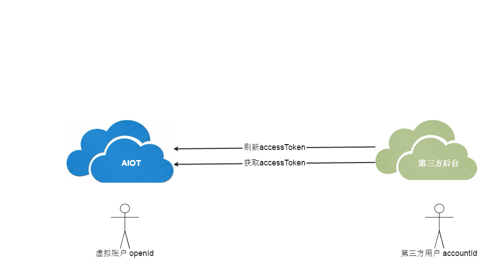

# 账户对接

用户的账户信息均存放在第三方后台，AIOT并不索取这些用户的信息，只是需要创建一个虚拟账号，并授权访问AIOT的业务接口。在此，我们提供两个API：
- 获取accessToken
- 刷新accessToken

通过这两个API，便可以方便地实现账户的对接。

---

##获取accessToken

| API | 描述 | payload | header | response |
| -- | -- | -- | -- | -- |
| /open/account/access/get | 用户获取接入权限 | {"accountId":"xxx"} | {"Appid":"xxx","Appkey":"xxx"} | {"code":0(errorCode), "result":{"openId":"xxx","accessToken":"xxx","expires_in":xxx,"refreshToken":"xxx"} |

> - payload: Https请求的payload，默认使用JSON格式
> - header: Https请求的header
> - accountId: 第三方应用用户的id
> - Appid: 第三方应用appId
> - Appkey: 第三方应用appKey
> - openId: 为第三方应用创建的虚拟对接账号
> - accessToken: 授权访问的token
> - expires_in: accessToken的有效期，单位为秒
> - refreshToken: 用于刷新accessToken
> - errorCode: 返回错误码，0表示成功

##刷新accessToken

| API | 描述 | payload | header | response |
| -- | -- | -- | -- | -- |
| /open/account/access/refresh | 刷新权限 | {"openId":"xxx","refreshToken":"xxx"} | {"Appid":"xxx","Appkey":"xxx"} | {"code":0(errorCode), "result":{"openId":"xxx","accessToken":"xxx","expires_in":xxx,"refreshToken":"xxx" |

当accessToken过期时，利用refreshToken和这个API，可以重新获取一对新的accessToken和refreshToken。