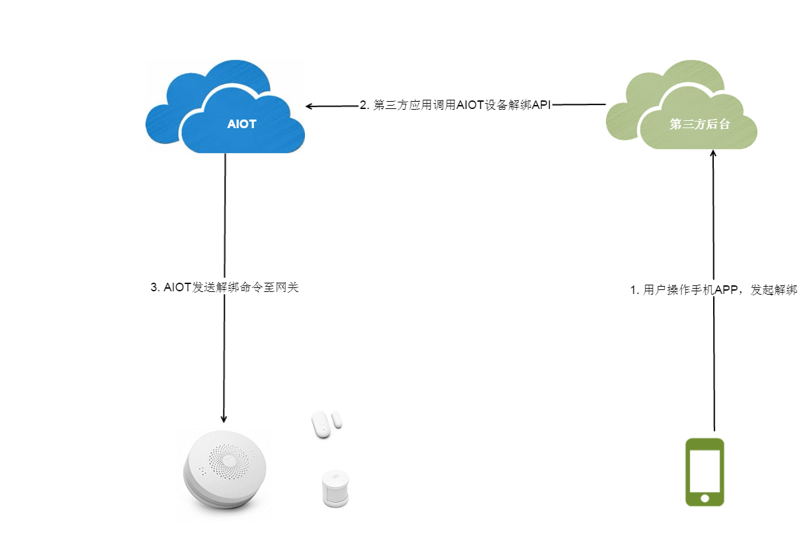

# 设备解绑

用户也可以解绑设备，解绑的方式对于网关类设备和子设备没什么差别，但都具有两种方式：

- 由手机APP发起设备解绑
- 设备自身触发解绑（长按重置键）

---

##手机APP发起设备解绑

手机APP发起设备解绑的流程如下：

1. 用户在手机APP上操作设备解绑
2. 解绑命令由AIOT发送至网关
3. 网关收到解绑消息，如果是子设备解绑就将子设备的信息删除，如果是网关解绑，就将网关保存的用户id删除掉，并同时开启可入网模式

| API | 描述 | payload | header | response |
| -- | -- | -- | -- | -- |
| /open/device/unbind | 设备解绑 | {"openId":"xxx","**did**":"xxx"} | {"**Appid**":"xxx","**Appkey**":"xxx","Openid":"xxx","**Access-Token**":"xxx"} | {"code":0(errorcode), "result":{"did":"value", "model":"value", "name":"value", "firmwareVersion": "value", "state":"value", "chipVersion":"value", "longitude":"value", "latitude":"value"}}} |
