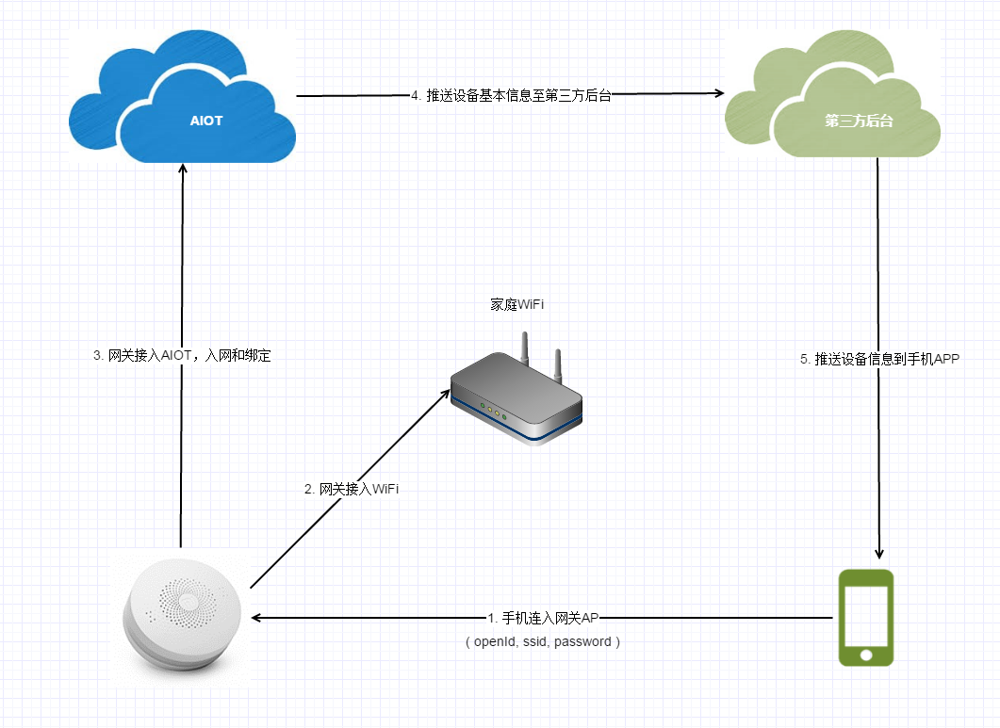

# 设备入网

用户拿到智能设备之后，首先需要将智能设备入网，就是通过家里的WiFi网络，接入AIOT，然后才能够对该智能设备进行管理和控制。绿米的智能硬件设备主要分为两大类：网关类设备和子设备，其中网关类设备（例如网关、空调伴侣、摄像头等具备网关功能的设备）具备WiFi芯片，可以直接接入互联网；子设备（例如人体传感器、智能插座、墙壁开关等）通过Zigbee接入网关，由网关来管理这些子设备。这两类设备的入网有所区别。

##网关类设备入网

网关类设备上电之后，需要通过手机APP协助网关接入wifi，这一步又被称为“快连”，然后接入AIOT，把设备基本信息上报，完成入网。主要过程是：

1. 手机接入网关AP（即网关提供的AP网络），手机APP将当前家里WiFi的ssid、密码和用户id发送给网关；
2. 网关断开AP，连上WiFi；
3. 网关接入AIOT，并将网关设备的信息和用户id发送给AIOT，完成入网和绑定；
4. AIOT推送设备基本信息给第三方服务后台；
5. 第三方后台将设备信息推送至用户手机APP。

